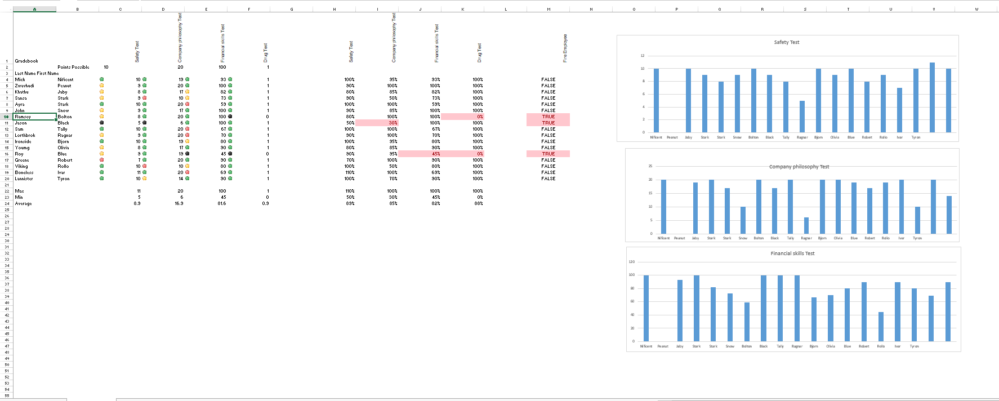

# Employee Performance Gradebook Dashboard

HR Analytics project built in Excel to automate employee performance tracking.

## What it does
- Tracks 3 key tests: Safety Test, Company Philosophy, Financial Skills
- Auto-calculates scores out of 100 and percentages
- Uses traffic light system (Icon Sets) to flag high/low performers
- Auto-flags employees at risk of being fired using IF logic (TRUE/FALSE)
- Shows MIN, MAX, AVERAGE and visual charts for management

## Skills Shown
Excel Formulas, Conditional Formatting, Icon Sets, IF Statements, Data Visualization, HR Analytics

## Files
- gradebook project.xlsx - full working workbook
- gradebook_dashboard.png - screenshot of dashboard

Built by Mick — Limpopo, South Africa

Built by Mick - Limpopo, South Africa
